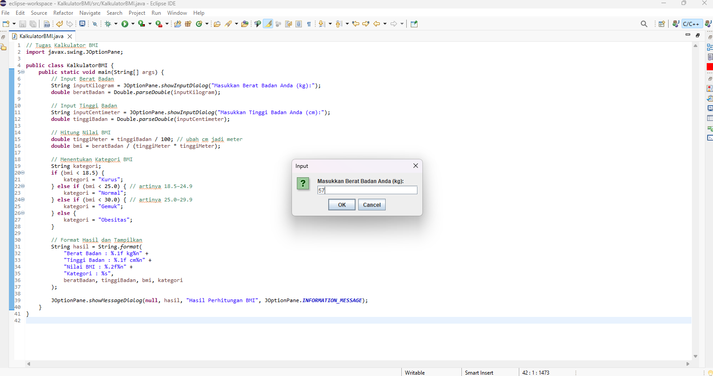
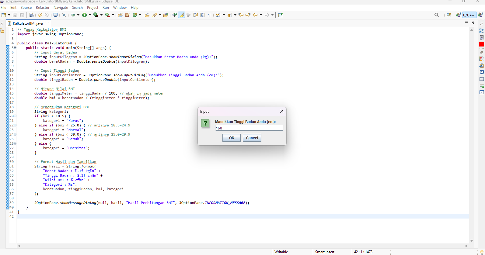
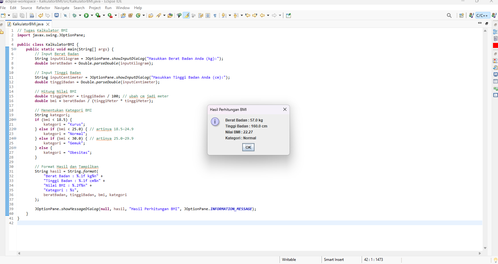

# 🧮 Program Kalkulator BMI Sederhana

## 👤 Identitas
- **Nama:** Astrid Dwi Pratiwi
- **NIM:** I.2510060
- **Mata Kuliah:** Algoritma dan Pemrograman  

---

## 🧠 Deskripsi
Program ini menghitung **BMI** menggunakan **JOptionPane** untuk input dan output.  
Langkah program:
1. Pengguna memasukkan berat badan 
2. Pengguna memasukkan tinggi badan
3. Hasil ditampilkan dalam kotak dialog  

---

## 💻 Cuplikan Kode

```java
import javax.swing.JOptionPane;

public class KalkulatorBMI {
    public static void main(String[] args) {
        // Input Berat Badan
        String inputKilogram = JOptionPane.showInputDialog("Masukkan Berat Badan Anda (kg):");
        double beratBadan = Double.parseDouble(inputKilogram);

        // Input Tinggi Badan
        String inputCentimeter = JOptionPane.showInputDialog("Masukkan Tinggi Badan Anda (cm):");
        double tinggiBadan = Double.parseDouble(inputCentimeter);

        // Hitung Nilai BMI
        double tinggiMeter = tinggiBadan / 100; // ubah cm jadi meter
        double bmi = beratBadan / (tinggiMeter * tinggiMeter);

        // Menentukan Kategori BMI
        String kategori;
        if (bmi < 18.5) {
            kategori = "Kurus";
        } else if (bmi < 25.0) { // artinya 18.5–24.9
            kategori = "Normal";
        } else if (bmi < 30.0) { // artinya 25.0–29.9
            kategori = "Gemuk";
        } else {
            kategori = "Obesitas";
        }

        // Format Hasil dan Tampilkan
        String hasil = String.format(
            "Berat Badan : %.1f kg%n" +
            "Tinggi Badan : %.1f cm%n" +
            "Nilai BMI : %.2f%n" +
            "Kategori : %s",
            beratBadan, tinggiBadan, bmi, kategori
        );

        JOptionPane.showMessageDialog(null, hasil, "Hasil Perhitungan BMI", JOptionPane.INFORMATION_MESSAGE);
    }
}
```

## 🔍 Hasil Uji Coba

### 💡 Input




### 📊 Output


---

## ✅ Kesimpulan
Program berhasil dijalankan dan menampilkan hasil perhitungan dengan benar.  
Penggunaan **JOptionPane** mempermudah interaksi dengan pengguna tanpa console.

---
